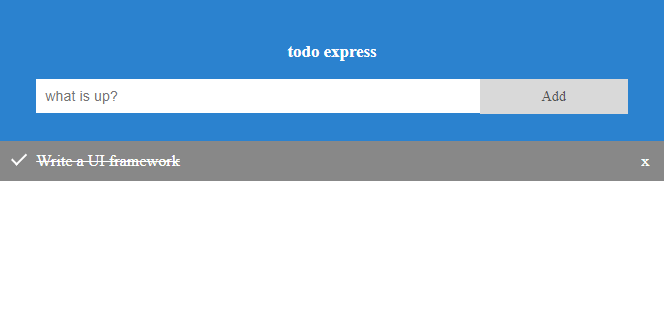

# SPUI - SimPle UI

SPUI is a library using an hyperscript syntax that helps create HTML Elements and automatically update the DOM when a data model changes. SPUI is fully DOM based (NOT vdom). 

### Buzzwords and hype galore

SPUI is simple to use. It is simple and small (about 500 LOC). It is blazing fast (tm). And it is yet another UI framework. This is my rite of passage as a web developer.

## Introduction

The goal of SPUI is to make it easy to create web application without relying on an external templating library (mustache), nor compiler (jsx). All code is pure Javascript and uses the Document Object Model (DOM). This is not a VirtualDom library. I found that working closely with the DOM without having an intermediary abstraction like a VDOM helps get things done more quickly. 

SPUI comes with a Stream module that makes it easy to define two way data bindings that will update the DOM automatically when model values are changed.

The SPUI streams enable that kind of workflow:

```javascript
// Label that updates automatically when a user types in an input field.
const model = valueStream('this is my initial value');
h('div', {}, [
    h('input', { value: model, oninput: selectTargetAttr('value', model) }),
    h('label', {}, model)
]);
```

## Getting Started

SPUI is basically an hyperscript function named `h` and a stream api to notify the DOM when model changes. The best way to dive into SPUI is to look at a dead simple TODO application example:

First we create 1 stream that will store whatever the user types in the `<input>` field:

```javascript
const newTitle = sp.valueStream('');
```

Then we create an `ObservableArray` that will store our list of Todo models. When this list is modifed (if we add or remove from it) the DOM will be notified and updated accordingly:

```javascript
const todos = new sp.ObservableArray();
```

Now let's add a function to add new todos to our list:

```javascript
function addTodo() {
    if (newTitle()) {
        todos.push(createTodo(newTitle()));
        newTitle('');
    }
};
```

Notice how our stream `newTitle` is a getter/setter function. When called with not arguments it returns the value it stores. When called with a single argument, it updates its backing value and notify all listeners about it.


We then add an helper function to create new todo:

```javacript
function createTodo (title: string, done = false) {
    return {
        title: sp.valueStream(title),
        done: sp.valueStream(done)
    };
}
```

Notice how `title` and `done` are implemented as streams: this means modifying thoses values will trigger a notification that will make the DOM update automatically.

It is now time to create a `view` using the hyperscript `h` function:

```javascript
const view = h('div', { id: 'todoapp'}, [
    h('div', {class: 'header'}, [
        h('h3', {}, 'todo express'),
        h('input', { type: 'text', 
                    // `newTitle` is used as a getter here. Each time it will be change
                    // the 'value' property will be updated as well.
                    value: newTitle, 
                    placeholder: 'what is up?', 
                    // `newTitle` is used as a setter each time a new character is typed. 
                    // `selectTargetAttr` is just an helper to extract the 'value` property from the event target.
                    oninput: sp.selectTargetAttr('value', newTitle) 
        }),
        // You can hook on to any dom events by adding an attribute prefixed with `on`
        h('span', { class: 'addBtn', onclick: addTodo }, 'Add'),
    ]),
    // This is how SPUI handles list of elements: we bind the ObservableArray to an Element list:
    sp.elementList('ul', {}, todos, (listNode: HTMLElement, todo: Todo) => {
        // This is the function that is called any time a new DOM element needs to be constructed 
        // for a new Todo object.
        return h('li', { class: { checked: todo.done }, 
                         onclick: () => todo.done(!todo.done()) }, [
            todo.title,
            // ObservableArray has a nifty remove function that will remove the Todo from the list
            // and notify the DOM about it:
            h('span', {class: 'close', onclick: () => todos.remove(todo)}, 'x')
        ]);
    })
]);
```

All that is left is to hook the view on to the body of the Document. Since the result of `h` is always an `HTMLElement` it is as easy as this:

```javascript
document.body.appendChild(view);
```

And that's it! We now have a todo application (like a millitoj other ones):



## More Examples

More complete examples can be found below:

- [TODO MVC](): the official [TODO MVC](http://todomvc.com/) has been implemented for SPUI will all kinds of nifty TODO workflows.
- [Table benchmarks]() and implementation of the world famous [JS Framework Benchmarks](https://github.com/krausest/js-framework-benchmark) using SPUI. This implementation is deceptively small and the performance is really good. It should be submitted to the official site soon(ish).
- [Markdown Editor](): really simple example on how to listen to changes in a `<textarea>` and live convert those changes in markdown.
- [Mini TODO]() because no web developer can't get enough TODO, this is the running app from the `Getting Started` example above.
- [Basic API usages]() this is a repository of snippets that showcases all the different functions of the SPUI Api. Some of these examples are used in the official Api documentation in the next section.

# API

## DOM Manipulation

These are all the functions that helps create an HTML view and manipulate DOM element. All of those functions can be used with the stream Api to benefits from the automatic DOM update. But you can use the hyperscript `h` function alone just to quickly create a new static HTML tree.

## h(tagName, attrs?, children?) -> HTMLElement

Argument    | Type                 | Required | Description
----------- | -------------------- | -------- | ---
`tagname`   | `Element`            | Yes      | A DOM element that will be the parent node to the subtree
`attrs`    | `Array<Vnode>|Vnode` | Yes      | The [vnodes](vnodes.md) to be rendered
`children`    | `Array<Vnode>|Vnode` | Yes      | The [vnodes](vnodes.md) to be rendered
**returns** |                      |          | Returns the newly created [HTMLElement](https://developer.mozilla.org/en-US/docs/Web/API/HTMLElement)

#### Description

pow this is a description

---

## elementList(tagName, attrs, models, elementCreator) -> HTMLElement

Argument    | Type                 | Required | Description
----------- | -------------------- | -------- | ---
`tagname`   | `Element`            | Yes      | A DOM element that will be the parent node to the subtree
`attrs`    | `Array<Vnode>|Vnode` | Yes      | The [vnodes](vnodes.md) to be rendered
`children`    | `Array<Vnode>|Vnode` | Yes      | The [vnodes](vnodes.md) to be rendered
**returns** |                      |          | Returns the newly created [HTMLElement](https://developer.mozilla.org/en-US/docs/Web/API/HTMLElement)

#### Description

pow this is a description

---

## selectTargetAttr(eventAttrName, handler) -> (event) => void

Argument    | Type                 | Required | Description
----------- | -------------------- | -------- | ---
`eventAttrName`   | `Element`            | Yes      | A DOM element that will be the parent node to the subtree
`handler`    | `Array<Vnode>|Vnode` | Yes      | The [vnodes](vnodes.md) to be rendered
**returns** |                      |          | Returns an event handler that can be hooked on to a [DOM event](https://developer.mozilla.org/en-US/docs/Web/Events).

#### Description

pow this is a description
---

## select(condition, ifTrue, ifFalse) -> HTMLElement

Argument    | Type                 | Required | Description
----------- | -------------------- | -------- | ---
`eventAttrName`   | `Element`            | Yes      | A DOM element that will be the parent node to the subtree
`handler`    | `Array<Vnode>|Vnode` | Yes      | The [vnodes](vnodes.md) to be rendered
**returns** |                      |          | Returns an event handler that can be hooked on to a [DOM event](https://developer.mozilla.org/en-US/docs/Web/Events).

#### Description

pow this is a description
---

## Stream

The stream API are based on the concept of getter/setter functions. These functions can be combined using helper method to create a stream of events that will trigger and transform the resulting values.

For more information on reactive programming you can look [here](https://www.google.ca/url?sa=t&rct=j&q=&esrc=s&source=web&cd=13&ved=0ahUKEwjmyufywZvXAhWs34MKHYgEBL8QFghjMAw&url=https%3A%2F%2Fgist.github.com%2Fstaltz%2F868e7e9bc2a7b8c1f754&usg=AOvVaw1AIbUOGhFWsI1yyAON-2FL).

SPUI streams are similar to [flyd](https://github.com/paldepind/flyd) and [mithril.js streams](https://mithril.js.org/stream.html). They are just less powerful and have less features :)

---

## valueStream(initialValue, transform?) -> Stream

Argument    | Type                 | Required | Description
----------- | -------------------- | -------- | ---
`initialValue`   | | Yes      | A DOM element that will be the parent node to the subtree
`transform`    | `Array<Vnode>|Vnode` | Yes      | The [vnodes](vnodes.md) to be rendered
**returns** |                      |          | Returns an event handler that can be hooked on to a [DOM event](https://developer.mozilla.org/en-US/docs/Web/Events).

#### Description

pow this is a description

---

## addListener(stream, listener) -> FunctorToStopListening

Argument    | Type                 | Required | Description
----------- | -------------------- | -------- | ---
`stream`   | | Yes      | A DOM element that will be the parent node to the subtree
`listener`    | `Array<Vnode>|Vnode` | Yes      | The [vnodes](vnodes.md) to be rendered
**returns** |                      |          | Returns an event handler that can be hooked on to a [DOM event](https://developer.mozilla.org/en-US/docs/Web/Events).

#### Description

pow this is a description

---

## removeListener(stream, listener) -> void

Argument    | Type                 | Required | Description
----------- | -------------------- | -------- | ---
`stream`   | | Yes      | A DOM element that will be the parent node to the subtree
`listener`    | `Array<Vnode>|Vnode` | Yes      | The [vnodes](vnodes.md) to be rendered

#### Description

pow this is a description

---

## addTransform(stream, transformer) -> void

Argument    | Type                 | Required | Description
----------- | -------------------- | -------- | ---
`stream`   | | Yes      | A DOM element that will be the parent node to the subtree
`listener`    | `Array<Vnode>|Vnode` | Yes      | The [vnodes](vnodes.md) to be rendered

#### Description

pow this is a description

---

## map(stream, transformer) -> Stream

Argument    | Type                 | Required | Description
----------- | -------------------- | -------- | ---
`stream`   | | Yes      | A DOM element that will be the parent node to the subtree
`listener`    | `Array<Vnode>|Vnode` | Yes      | The [vnodes](vnodes.md) to be rendered

#### Description

pow this is a description

---

## compute(functor, transformer) -> Computation

Argument    | Type                 | Required | Description
----------- | -------------------- | -------- | ---
`stream`   | | Yes      | A DOM element that will be the parent node to the subtree
`listener`    | `Array<Vnode>|Vnode` | Yes      | The [vnodes](vnodes.md) to be rendered

#### Description

pow this is a description

---

## computeStream(functor, transformer) -> Stream

Argument    | Type                 | Required | Description
----------- | -------------------- | -------- | ---
`stream`   | | Yes      | A DOM element that will be the parent node to the subtree
`listener`    | `Array<Vnode>|Vnode` | Yes      | The [vnodes](vnodes.md) to be rendered

#### Description

pow this is a description

---

## eventStream(source, name, useCapture?) -> Stream

Argument    | Type                 | Required | Description
----------- | -------------------- | -------- | ---
`stream`   | | Yes      | A DOM element that will be the parent node to the subtree
`listener`    | `Array<Vnode>|Vnode` | Yes      | The [vnodes](vnodes.md) to be rendered

#### Description

pow this is a description

---


## ObservableArray

ObservableArray are a wrapper over a builtin javascript array. It reimplements all the mutators functions (`push`, `pop`, `splice`, `shift`, `unshift`, `sort`, `reverse`) and broadcast events to listeners when any of those mutators are applied. SPUI `elementList` function listens to changes happening in an ObservableArray model to update the DOM by adding or removing new models.

### ObservableArray declaration

```javascript
class ObservableArray<T> {
    array: T[];
    listeners: ArrayListener[];
    constructor(array?: T[]);
    readonly length: number;
    
    push(...args: any[]): any;
    pop(...args: any[]): any;
    reverse(...args: any[]): any;
    shift(...args: any[]): any;
    splice(...args: any[]): any;
    sort(...args: any[]): any;
    unshift(...args: any[]): any;
    remove(value: T): void;

    applyChanges(changeFunctor: () => any): any;
    addListener(callback: ArrayListener): () => any[];
    removeListener(callback: ArrayListener): any[];
}
```

## Notes on Mutator functions


## applyChanges(changeFunctor) -> Stream

Argument    | Type                 | Required | Description
----------- | -------------------- | -------- | ---
`stream`   | | Yes      | A DOM element that will be the parent node to the subtree
`listener`    | `Array<Vnode>|Vnode` | Yes      | The [vnodes](vnodes.md) to be rendered

#### Description

pow this is a description

---

## addListener(arrayChangeListener) -> RemoveListenerFunctor

Argument    | Type                 | Required | Description
----------- | -------------------- | -------- | ---
`stream`   | | Yes      | A DOM element that will be the parent node to the subtree
`listener`    | `Array<Vnode>|Vnode` | Yes      | The [vnodes](vnodes.md) to be rendered

#### Description

pow this is a description

---

## removeListener(arrayChangeListener)

Argument    | Type                 | Required | Description
----------- | -------------------- | -------- | ---
`stream`   | | Yes      | A DOM element that will be the parent node to the subtree
`listener`    | `Array<Vnode>|Vnode` | Yes      | The [vnodes](vnodes.md) to be rendered

#### Description

pow this is a description

---

## Filter

### Filter declaration

```javascript
class Filter<T> {
    src: ObservableArray<T>;
    filtered: ObservableArray<T>;
    predicate: FilterPredicate<T>;
    constructor(src: ObservableArray<T>, predicate: FilterPredicate<T>);
    applyFilter(predicate?: FilterPredicate<T>, reset?: boolean): Changes;
}
```

## Filter.constructor(src, predicate)

Argument    | Type                 | Required | Description
----------- | -------------------- | -------- | ---
`stream`   | | Yes      | A DOM element that will be the parent node to the subtree
`listener`    | `Array<Vnode>|Vnode` | Yes      | The [vnodes](vnodes.md) to be rendered

#### Description

pow this is a description

---

## filtered ObservableArray

## applyFilter(predicate?, reset?) : Changes

Argument    | Type                 | Required | Description
----------- | -------------------- | -------- | ---
`stream`   | | Yes      | A DOM element that will be the parent node to the subtree
`listener`    | `Array<Vnode>|Vnode` | Yes      | The [vnodes](vnodes.md) to be rendered

#### Description

pow this is a description

---